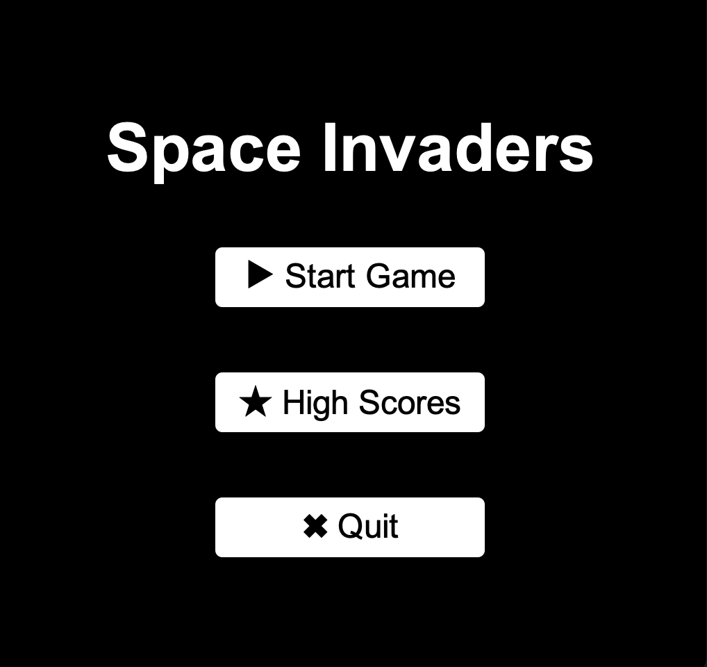
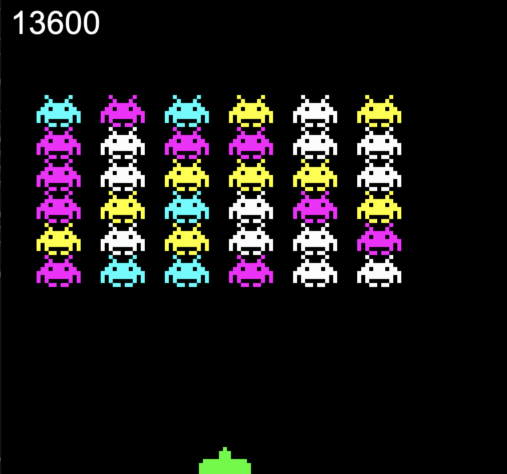
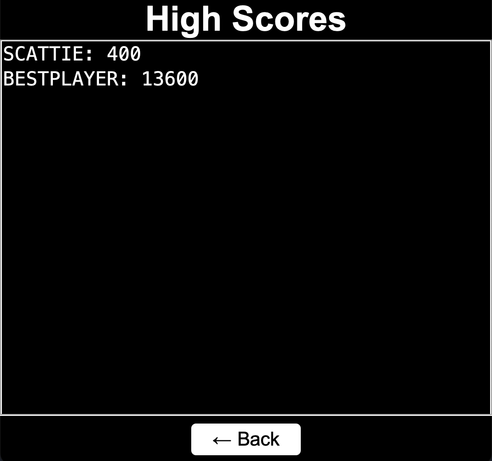

# 👾 Space Invaders MVC

A retro-style **Space Invaders** game built in Java using the **Model-View-Controller (MVC)** design pattern. Fly your ship, shoot aliens, and track your high scores, all in a Swing-based GUI.

<div align="center">

  
  
  

</div>

### ✅ Prerequisites

- Java JDK 17 or later
- Extension Pack for Java (recommended)

## 🎮 Controls

- `←` Move left
- `→` Move right
- `Space` Shoot
- Any key after Game Over → Restart the game

## 🗂 Folder Structure

```
├── README.md
└── src
├── App.java
├── controller
│ └── GameController.java
├── data
│ ├── ScoreReader.java
│ └── ScoreWriter.java
├── model
│ ├── GameModel.java
│ ├── ScoreManager.java
│ └── entitites
├── resources
└── view
```

## 🧠 Architecture: MVC

- **Model** – Game logic: `GameModel`, `Ship`, `Alien`, `Bullet`, `ScoreManager`
- **View** – Rendering UI: `GameView`, `MainMenuView`, `HighScoresView`
- **Controller** – Input and timing: `GameController`

## 🛠️ How to Run

### Running the Project in Your IDE

1. Open the project folder in VS Code.
2. Make sure `App.java` is set as the entry point.
3. Click the `Run` button or press `F5`.

### Using Terminal

```bash
javac -d bin -sourcepath src src/App.java
java -cp bin App
```
